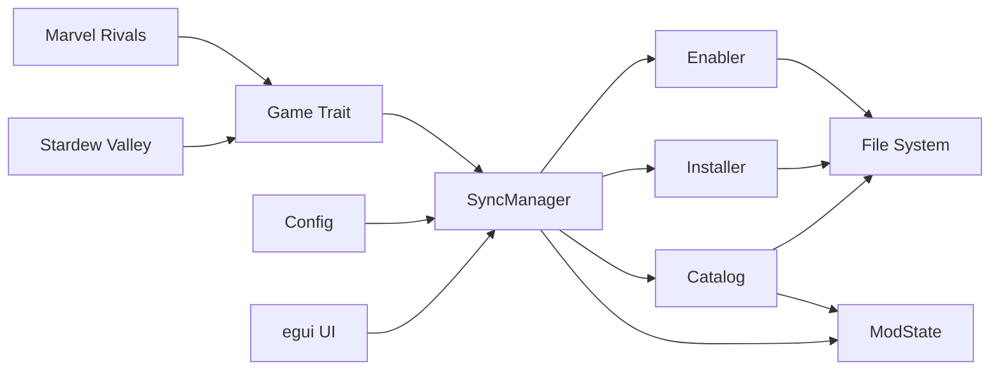
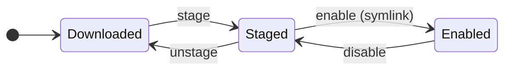

# Moda

## Project Overview

Mod manager for Linux built with Rust + egui. Starting with Stardew Valley, designed for multi-game extensibility.

## Showcase

**Main Page**

**Mod Manager Page**


## Developer Commands

```bash
cargo run --bin moda                  # Run the app
cargo test                            # Run all tests
cargo test <test_name>                # Run single test
cargo clippy -- -D warnings          # Lint (fail on warnings)
cargo fmt -- --check                 # Check formatting
```

## Architecture

### Core Design Principles

- **Game-agnostic core**: Game-specific logic lives in separate modules/crates, not in core
- **Stock game approach**: Keep game folder clean; manage mods in a separate library folder (like Wabbajack)
- **Profile-based**: Support multiple profiles per game from the start
- **Mod collections**: Support both native JSON format and Nexus collections import

### Current Crate Structure

```
moda/
├── Cargo.toml
├── src/
│   ├── main.rs              # eframe entrypoint
│   ├── lib.rs               # Re-exports public modules
│   ├── config.rs            # Config loading from ~/.config/moda/config.toml
│   ├── error.rs             # Error handling
│   ├── games/
│   │   ├── mod.rs           # Game trait definition
│   │   ├── stardew.rs       # Stardew Valley implementation
│   │   ├── mad_max.rs       # Mad Max implementation
│   │   └── marvel_rivals.rs # Marvel Rivals implementation
│   ├── mods/
│   │   ├── mod.rs           # Re-exports public mod modules
│   │   ├── catalog.rs       # Mod catalog (indexing available mods)
│   │   ├── mod_state.rs     # Mod state tracking
│   │   ├── types.rs         # Shared mod types
│   │   ├── downloader/
│   │   │   ├── mod.rs       # Downloader abstraction
│   │   │   └── nexus.rs     # Nexus API client
│   │   ├── enabler/
│   │   │   ├── mod.rs                     # Enabler abstraction
│   │   │   ├── symlink_enabler.rs         # Symlink mods to game folder
│   │   │   ├── direct_copy_enabler.rs     # Copy files to game folder
│   │   │   └── pak_enabler.rs             # Pak files (e.g. RE2 Remake)
│   │   ├── orchestrator/
│   │   │   ├── mod.rs       # Orchestrator abstraction
│   │   │   └── sync_manager.rs  # Sync logic between library and game folder
│   │   └── stager/
│   │       ├── mod.rs                     # Stager abstraction
│   │       ├── direct_copy_stager.rs      # Direct copy staging
│   │       └── zip_stager.rs              # Zip extraction staging
│   ├── profiles/
│   │   └── mod.rs           # Profile management (stub)
│   └── ui/
│       ├── mod.rs           # UI module root
│       ├── app.rs           # eframe App state management
│       ├── active_game.rs   # Active game UI state
│       ├── style.rs         # egui styling
│       ├── components/
│       │   ├── mod.rs
│       │   └── game_card.rs # Game selection card widget
│       ├── pages/
│       │   ├── mod.rs
│       │   ├── game_selection.rs  # Game selection page
│       │   └── mod_manager.rs     # Mod manager page
│       └── widgets/
│           ├── mod.rs
│           └── dir_browser.rs     # Directory browser widget
└── tests/
    ├── mod.rs
    ├── config_test.rs
    ├── games/
    │   ├── mod.rs
    │   ├── stardew_test.rs
    │   └── mad_max.rs
    └── mods/
        ├── mod.rs
        ├── catalog_test.rs
        ├── mod_state_test.rs
        ├── test_util.rs
        ├── downloader/
        │   ├── mod.rs
        │   └── nexus_test.rs
        ├── enabler/
        │   ├── mod.rs
        │   └── enabler_test.rs
        ├── orchestrator/
        │   ├── mod.rs
        │   └── sync_manager_test.rs
        └── stager/
            ├── mod.rs
            ├── direct_copy_stager_test.rs
            └── zip_stager_test.rs
```

## Flow

### Component Interaction



### Mod Lifecycle



## Important Constraints

- **Rust learning project**: My first rust project :)
- **egui UI**: State management via `eframe::App` with modular pages under `src/ui/`
- **Nexus API**: Requires API key if want to download mods automatically without a browser; store in
  `~/.config/moda/config.toml`
- **Collections**: Two formats planned — native JSON format + Nexus collections import
