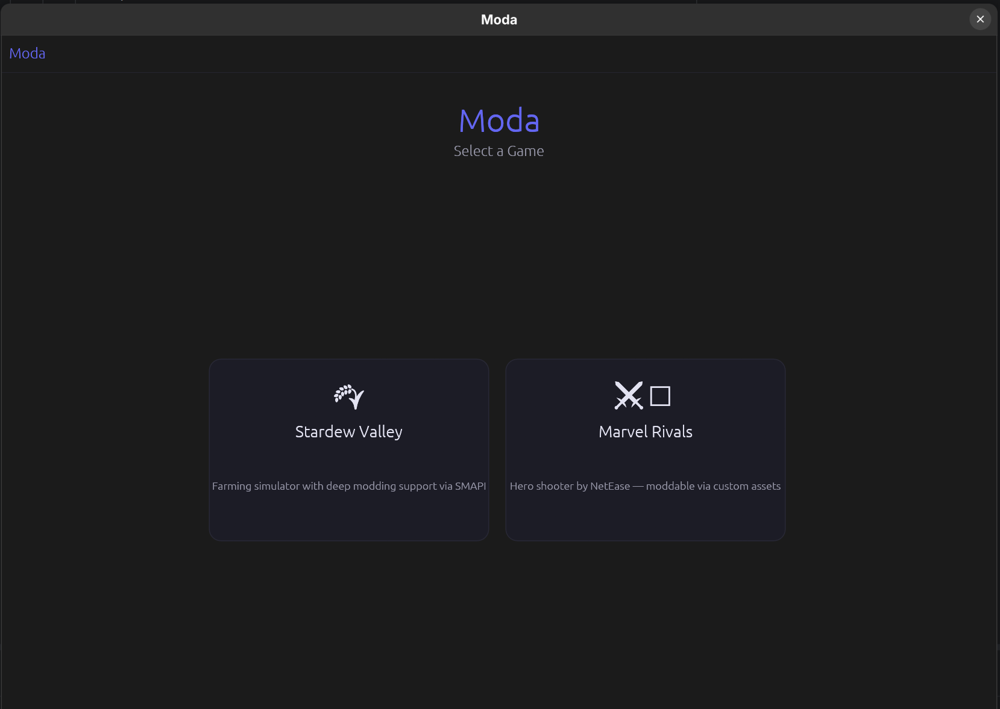
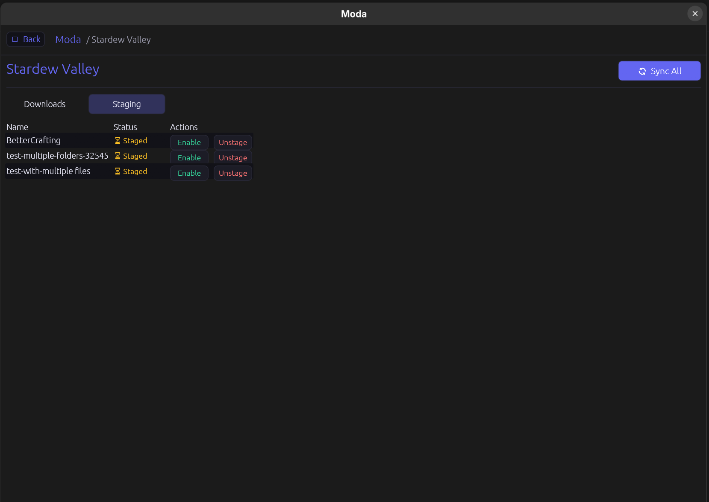
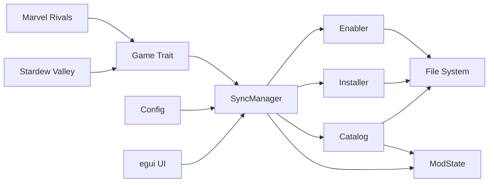
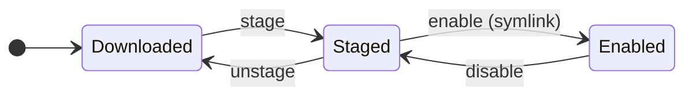

# Moda

## Project Overview
Mod manager for Linux built with Rust + egui. Starting with Stardew Valley, designed for multi-game extensibility.

## Showcase

**Main Page**

**Mod Manager Page**



## Developer Commands
```bash
cargo run --bin moda                  # Run the app
cargo test                            # Run all tests
cargo test <test_name>                # Run single test
cargo clippy -- -D warnings          # Lint (fail on warnings)
cargo fmt -- --check                 # Check formatting
```

## Architecture

### Core Design Principles
- **Game-agnostic core**: Game-specific logic lives in separate modules/crates, not in core
- **Stock game approach**: Keep game folder clean; manage mods in a separate library folder (like Wabbajack)
- **Profile-based**: Support multiple profiles per game from the start
- **Mod collections**: Support both native JSON format and Nexus collections import

### Current Crate Structure
```
moda/
├── Cargo.toml
├── src/
│   ├── main.rs              # eframe entrypoint
│   ├── lib.rs               # Re-exports public modules
│   ├── config.rs            # Config loading from ~/.config/moda/config.toml
│   ├── error.rs             # Error handling
│   ├── ui/                  # egui UI (app, pages, widgets)
│   ├── games/
│   │   ├── mod.rs           # Game trait definition
│   │   └── stardew.rs       # Stardew Valley implementation
│   ├── mods/
│   │   ├── mod.rs           # Re-exports public mod modules
│   │   ├── downloader/
│   │   │   ├── mod.rs       # Downloader abstraction
│   │   │   └── nexus.rs     # Nexus API client
│   │   ├── enabler.rs       # Mod enable/disable management
│   │   ├── installer.rs     # Mod installation logic (ModSource enum + Installer struct)
│   │   ├── mod_registry.rs  # Mod registry / lookup
│   │   ├── mod_state.rs     # Mod state tracking
│   │   └── sync_manager.rs  # Sync logic between library and game folder
│   └── profiles/
│       └── mod.rs           # Profile management (stub)
└── tests/
    ├── games/
    ├── mods/
    └── profiles/
```

## Flow

### Component Interaction


### Mod Lifecycle


## Important Constraints
- **Rust learning project**: My first rust project :)
- **egui UI**: State management via `eframe::App` with modular pages under `src/ui/`
- **Nexus API**: Requires API key if want to download mods automatically without a browser; store in `~/.config/moda/config.toml`
- **Collections**: Two formats planned — native JSON format + Nexus collections import
